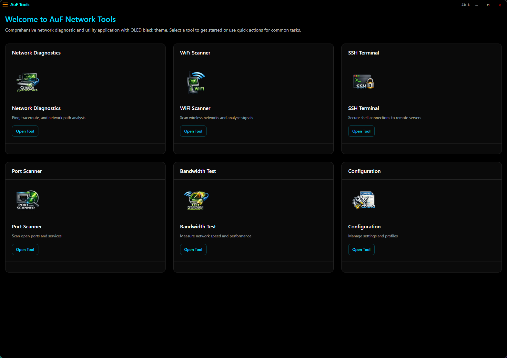
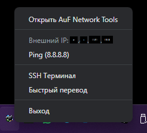

# AuF Network Tools

<div align="center">


**Professional Network Tools Suite with Modern OLED Black Design**

[](https://opensource.org/licenses/MIT)
[](https://github.com/eXLu51ve/AuF-Network-Tools/releases)
[](https://github.com/eXLu51ve/AuF-Network-Tools)

[🇬🇧 English](#) | [🇷🇺 Русский](README.md)

</div>

---

## 📋 Table of Contents

- [About](#-about)
- [Features](#-features)
- [Installation](#-installation)
- [Screenshots](#-screenshots)
- [Usage](#-usage)
- [Development](#-development)
- [Technologies](#-technologies)
- [License](#-license)

---

##  About

**AuF Network Tools** is a comprehensive network diagnostic and analysis application built with modern Electron, React, and TypeScript technologies. The application provides professional network tools in an elegant interface with OLED Black theme.

### Key Features:

- 🎨 **OLED Black Theme** — true black (#000000) background for comfortable work
- ⚡ **High Performance** — optimized code and fast response
- 🌐 **Multilingual** — Russian and English support
- 🔒 **Security** — AES-GCM credential encryption
- 🎭 **Smooth Animations** — modern page transitions (300ms)
- 📊 **Data Visualization** — real-time charts and graphs

---

## 🚀 Features

### 🌐 Network Diagnostics

- **Ping Tool** — host availability check with real-time visualization
- **Traceroute** — network path analysis hop-by-hop
- **DNS Resolver** — forward/reverse DNS resolution with multiple record types

### 📡 WiFi Analysis

- **WiFi Scanner** — detect and analyze wireless networks
- **Channel Analysis** — visualize channel overlap and interference
- **Signal History** — monitor signal strength changes over time
- **Band Metrics** — compare 2.4GHz and 5GHz performance

### 🔐 SSH Tools

- **SSH Terminal** — full-featured terminal with xterm.js
- **13 Beautiful Themes** — Termius Dark/Light, Matrix, Dracula, Nord, Tokyo Night, etc.
- **256 Colors Support** — full xterm-256color palette
- **Connection Manager** — save and manage SSH profiles
- **File Manager** — secure SCP file transfer
- **Encrypted Storage** — AES-GCM credential encryption

### 🔍 Port Scanner

- **Local Scanning** — check ports in local network
- **External Scanning** — check port availability from internet
- **Service Detection** — identify running services
- **Parallel Scanning** — fast multi-threaded scanning

### 📊 Network Utilities

- **Speed Test** — real download/upload speed measurements
- **ICMP Ping** — to 8.8.8.8 (average of 4 requests)
- **64 Parallel Connections** — for accuracy
- **Dual Graphs** — separate Download and Upload charts
- **Works in Russia** — without VPN (Yandex.Internetometer approach)

### ⚙️ Settings & Configuration

- **Security** — auto-lock, audit logging, rate limiting
- **Appearance** — themes, font size, compact mode, animations
- **Notifications** — event alerts configuration
- **Performance** — parallel operations, caching
- **Credentials** — secure SSH keys and passwords storage
- **Keyboard Shortcuts** — customizable hotkeys

### 🎯 System Tray

- **External IP Display** — updates every 60 seconds
- **Quick SSH Access** — open SSH terminal instantly
- **Ping 8.8.8.8** — opens CMD with continuous ping
- **Quick Translate** — translate clipboard text via Google Translate

---

##  Installation

### System Requirements

- **OS:** Windows 10/11 (64-bit), macOS 10.13+, Linux
- **RAM:** 4 GB minimum, 8 GB recommended
- **Disk:** 250 MB free space
- **Internet:** For Speed Test and some features

### Download Installers

<div align="center">

| Type | Size | Link |
|------|------|------|
| 🪟 **Windows Installer** | 97.7 MB | [Download Setup.exe](releases/AuF%20Network%20Tools-1.0.0-Setup.exe) |
| 📦 **Windows Portable** | 97.5 MB | [Download Portable.exe](releases/AuF%20Network%20Tools-1.0.0-Portable.exe) |

</div>

### Installation (Windows Installer)

1. Download `AuF Network Tools-1.0.0-Setup.exe`
2. Run the installer
3. Choose installation folder (default: `C:\Program Files\AuF Network Tools`)
4. Wait for installation to complete
5. Application will start automatically
6. Shortcuts created on desktop and Start menu

### Portable Version

1. Download `AuF Network Tools-1.0.0-Portable.exe`
2. Copy to any folder
3. Run the exe file
4. Done! Settings are saved next to exe

---

## 📸 Screenshots

### Dashboard

*Main page with cards of all available tools. Modern design with smooth transition animations.*

### SSH Terminal

*Full-featured SSH terminal with 13 themes, 256 colors support, and file manager.*

### Network Diagnostics

*Network diagnostic tools: Ping, Traceroute, and DNS Resolver with result visualization.*

### WiFi Scanner

*Wireless network scanning with signal strength analysis, channel utilization, and recommendations.*

### Port Scanner

*Local and external port scanning with service detection.*

### Network Utilities

*Internet speed test with real Download/Upload measurements and ICMP ping. Glassmorphism design with graphs.*

### System Tray

*System tray menu: ping check, external IP view, quick SSH terminal access, and quick text translation.*

---

##  Usage

### First Launch

1. Start the application
2. Dashboard opens with tool cards
3. Click any card to navigate to the tool
4. Enjoy smooth animations!

### Quick Access

- **System Tray** — right-click tray icon
- **Keyboard Shortcuts** — configure in Settings → Shortcuts
- **Side Menu** — click menu icon (☰) for navigation

### Change Language

1. Open Settings (⚙️)
2. Go to "Appearance" tab
3. Select language: English or Русский

---

## 🛠️ Development

### Development Requirements

- Node.js 18+
- npm or yarn
- Git

### Clone Repository

```bash
git clone https://github.com/eXLu51ve/AuF-Network-Tools.git
cd AuF-Network-Tools
```

### Install Dependencies

```bash
npm install
```

### Run in Development Mode

```bash
npm run build    # Build main and renderer processes
npm run dev      # Run application
```

### Build for Production

```bash
npm run build              # Build code
npm run package:win        # Windows installer + portable
npm run package:mac        # macOS DMG
npm run package:linux      # Linux AppImage
```

### Project Structure

```
AuF-Network-Tools/
├── src/
│   ├── main/              # Main process (Electron)
│   │   ├── index.ts       # Entry point
│   │   ├── preload.ts     # Preload script
│   │   └── services/      # Services (Network, SSH, SpeedTest)
│   └── renderer/          # Renderer process (React)
│       ├── App.tsx        # Main component
│       ├── Router.tsx     # Routing
│       ├── components/    # Components
│       ├── pages/         # Pages
│       ├── contexts/      # React contexts
│       └── i18n/          # Translations
├── build/                 # Build resources
├── releases/              # Ready installers
├── screen/                # Screenshots
├── img/                   # README icons
├── docs/                  # Documentation
└── package.json
```

---

## 🔧 Technologies

### Frontend

- **Electron** 25.9.8 — cross-platform framework
- **React** 18.2.0 — UI library
- **TypeScript** 5.0+ — typed JavaScript
- **Material-UI** 5.14.0 — UI components
- **Framer Motion** 10.16.0 — animations
- **Recharts** 3.8.1 — charts and graphs
- **xterm.js** 6.0.0 — terminal
- **React Router** 7.14.2 — routing

### Backend (Main Process)

- **Node.js** 18+
- **SSH2** 1.17.0 — SSH client
- **node-pty** 1.1.0 — pseudoterminal
- **dns-packet** 5.6.1 — DNS parsing

### Build Tools

- **Vite** 4.4.0 — bundler
- **electron-builder** 24.6.0 — installer creation
- **TypeScript Compiler** — TS compilation

---

##  Note

### Known Issues

- **Antiviruses** may block installer (false positive)
  - Solution: add to exceptions or use portable version
- **Speedtest.net blocked in Russia**
  - Solution: using Yandex.Internetometer approach (already implemented)
- **First launch** may take 2-3 seconds

### Security

- All credentials encrypted with AES-GCM
- Audit logging of all operations
- Input validation
- Secure SSH key storage

---

## 📄 License

This project is licensed under the MIT License - see the [LICENSE](LICENSE) file for details.

---

## 👨‍💻 Author

**eXLu51ve**

---

## 🤝 Contributing

Contributions are welcome! Please:

1. Fork the repository
2. Create your feature branch (`git checkout -b feature/AmazingFeature`)
3. Commit your changes (`git commit -m 'Add some AmazingFeature'`)
4. Push to the branch (`git push origin feature/AmazingFeature`)
5. Open a Pull Request

---

## 📞 Support

If you encounter problems:

1. Check [Issues](https://github.com/eXLu51ve/AuF-Network-Tools/issues)
2. Create a new Issue with problem description
3. Attach screenshots and logs

---

<div align="center">

**Made with ❤️ in Russia**

[⬆ Back to Top](#auf-network-tools)

</div>
